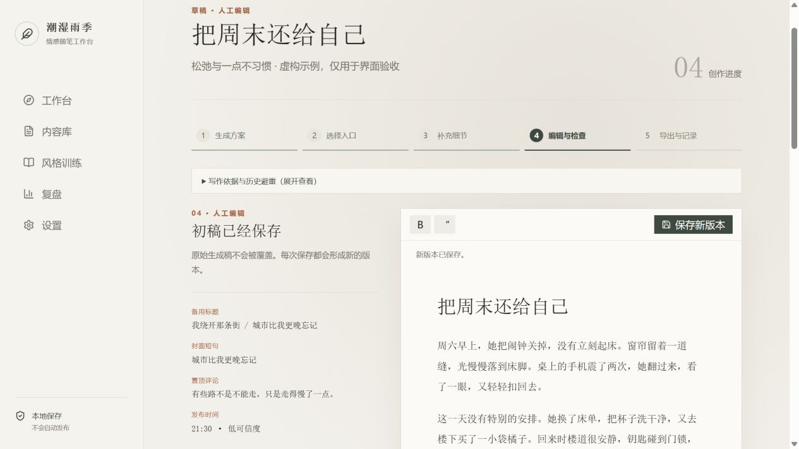
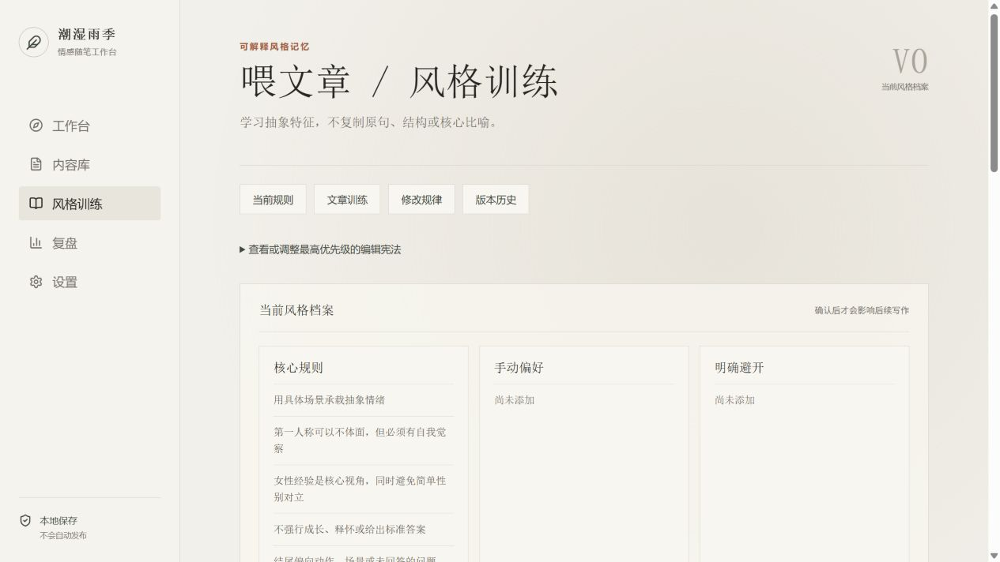
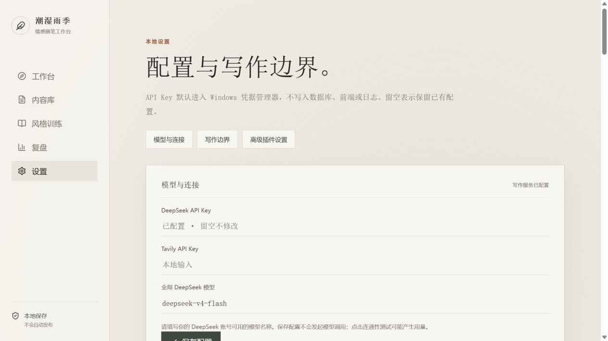
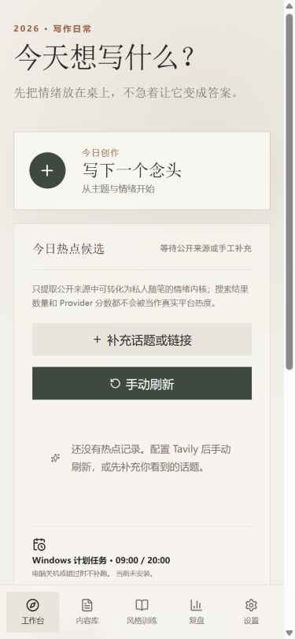
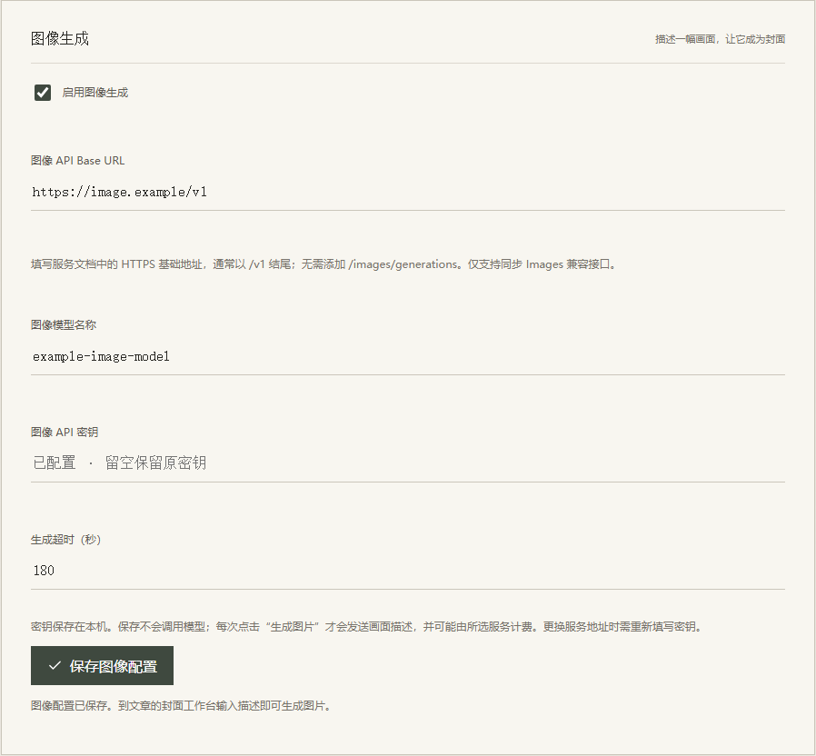
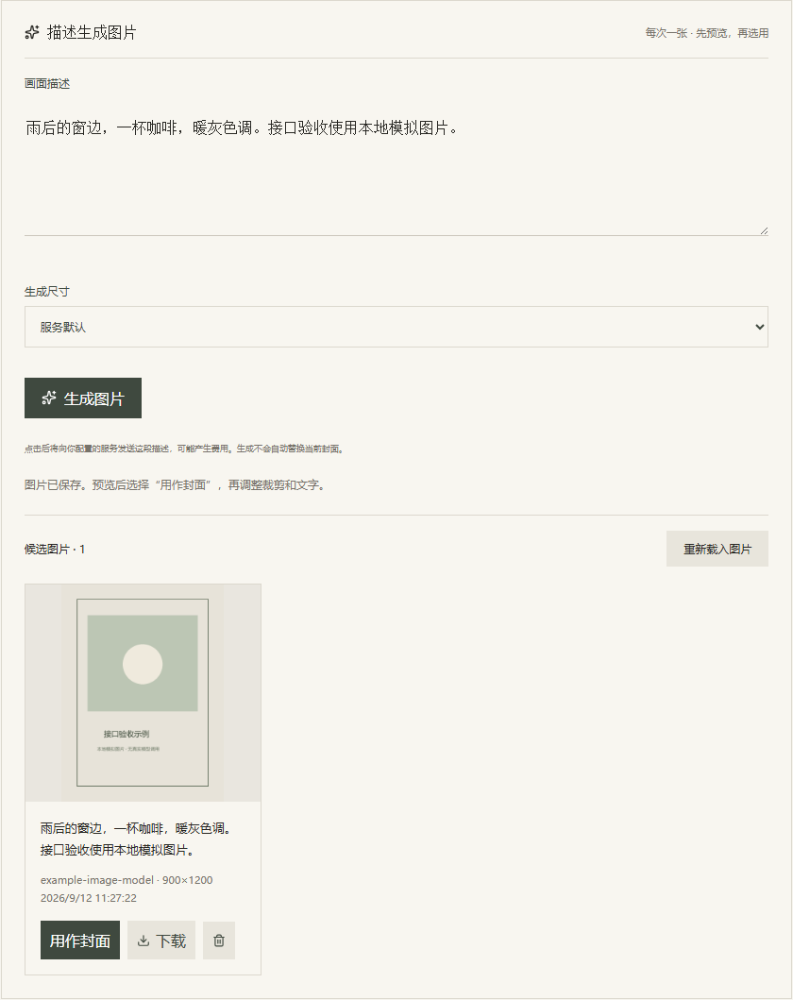
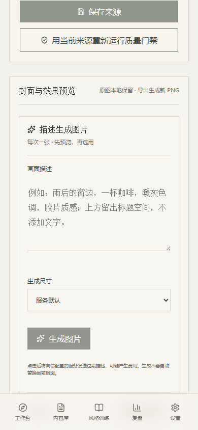

# 发布准备、图像生成与全面复查验收说明

基础整理验收日期：2026-09-11；图像生成与全面复查日期：2026-09-12。当前状态：本地优化、图像生成与整理完成，等待项目所有者人工验收；尚未上传 GitHub。本轮问题与证据详见 [全面复查报告](全面复查报告.md)。

后续已完成真实 DeepSeek、Tavily 和 Windows OCR 实测，并修复 OCR 文件覆盖与创建失败提示问题。最新测试为后端 130 项、前端 31 项；最新包为 `chaoshi-yuji-live-tested-20260912.zip`。下表保留前一轮基线，最新记录见 [真实服务实测报告](真实服务实测报告.md)。

## 本次交付

- 保留“潮湿雨季”名称、女性情感短随笔定位、单账号与人工确认流程。
- 前端拆分为页面、组件、请求模块和共享类型；后端按九类业务组织路由。
- 改善设置分组、风格规则比较、手机导航、创作步骤、编辑反馈与失败后的继续入口。
- 修复安装失败检查、环境变量示例、迁移目录和重复启动问题，整理中文文档与发布工具。
- 封面工作台增加可配置 Images 兼容接口、文字生图、候选本地保存、预览、下载、选用和删除。
- 公开源码副本不带原 Git 历史；原项目、个人数据与原提交历史仍留在本地。暂未添加许可证。

## 已完成的检查

| 检查 | 结果 |
| --- | --- |
| 后端 pytest | 127 项通过；其中图像接口测试文件 38 项；整体语句覆盖率 83% |
| 前端 Vitest | 29 项通过；覆盖候选刷新保留编辑、文章切换竞态和损坏配置恢复 |
| 前端 oxlint | 通过，无告警 |
| TypeScript + Vite 生产构建 | 通过 |
| npm audit | 2026-09-12 查询及新安装检查为 0 项已知漏洞 |
| Python pip check | 2026-09-12 原环境与新安装环境均通过，无损坏依赖关系 |
| 干净目录首次安装 | 全面复查版重新验证全新虚拟环境、锁定依赖、前端构建及完整迁移 |
| 隔离副本重复启动与停止 | 两次启动复用相同 PID；停止后端口释放 |
| 迁移重复执行 | 使用指定隔离目录，连续升级至 head 成功 |
| 桌面与 390 像素手机布局 | 工作台、内容库、设置、风格、创作、复盘检查通过，未发现横向溢出 |
| 浏览器实际操作 | 富文本编辑器保存新版本成功，检查期间浏览器错误日志为空 |
| 图像浏览器流程 | 独立 Chrome 自动化浏览器连接本地模拟服务：保存配置不生图，显式生成一次，下载、选用、PNG 渲染、重新打开与候选刷新保留编辑通过 |
| 图像桌面与手机布局 | 1280 像素桌面与 390 像素手机无横向溢出，浏览器页面错误为空；截图人工检查 |
| 原仓库状态 | 原开发历史保留，没有配置或推送远程仓库 |

测试基线为后端 62 项、前端 13 项；新增测试针对本次发现的问题。后端测试仍有一条上游 Starlette 测试客户端的弃用提示，不影响测试通过。

全面复查后，首页主 JavaScript 块约 **248.83 KB**（gzip 79.47 KB），相较最初约 671.68 KB 仍减少约 **63%**。编辑器改为进入创作页时加载；此数据是构建产物体积，不是网络加载时间测试。

依赖调整包含统一 Tiptap 到 3.31.3、更新 Vitest 及间接依赖、移除未使用的图片扩展与路由库。编辑器相关修复依据见 [Tiptap 属性合并公告](https://github.com/advisories/GHSA-cp6q-959q-f8rh) 与 [Markdown 属性解析公告](https://github.com/advisories/GHSA-j95f-988m-3j2f)。

## 建议你亲自验收的操作

1. 打开工作台，查看文艺风格、导航名称和手机布局是否符合习惯。
2. 在内容库搜索并打开文章，编辑标题或正文，保存后重新打开，确认版本保留。
3. 查看创作步骤和失败后的继续入口，确认已保存的方案与细节无需重复填写。
4. 到风格训练页查看当前规则；试用编辑、取消、明确确认、历史差异与恢复。
5. 到设置页检查模型配置、写作边界和插件分组；密钥留空表示不修改，连通性测试需要手动点击。
6. 试用封面预览和发布包；核对完整使用说明是否足以让新使用者安装。
   如需生图，先配置自己可用的图像服务和模型，再输入描述生成、预览、选作封面并导出。
7. 审阅发布源码、截图和保留的默认写作规则，确认可以公开后，再明确授权上传。

## 验证范围与保留项

本次使用隔离的虚构数据，不将个人文章、数据库、截图原图或密钥放入公开副本。模型和搜索流程通过假 Provider 或模拟响应验证，未产生真实 AI 调用费用。

图像协议使用模拟 HTTP 响应覆盖 Base64、URL、重定向、密钥错误、限流、超时、无效图片与过量返回。浏览器示例图明确标为“接口验收示例”，由本地测试程序绘制，不能代表任何图像模型的实际效果。真实厂商连通性、模型权限、计费与生成效果尚未验证，需在使用者配置服务后确认。

最新源码目录和 ZIP 使用 `release/chaoshi-yuji-reviewed-20260912` 名称，与先前图像生成版分开保留。发布包不带原 Git 历史、数据库、密钥、上传图片或开发环境；文档中的示例截图属于可公开的模拟验收材料。

Docker、Windows 原生 OCR 的实际识别效果、计划任务安装以及 GitHub Actions 的远端运行不计为本次实测通过项。现有相关单元测试通过；Docker 仍作为辅助配置保留，CI 将在获准上传后运行。

## 界面示例

以下图片使用虚构演示内容，与个人账号和真实文章无关。

